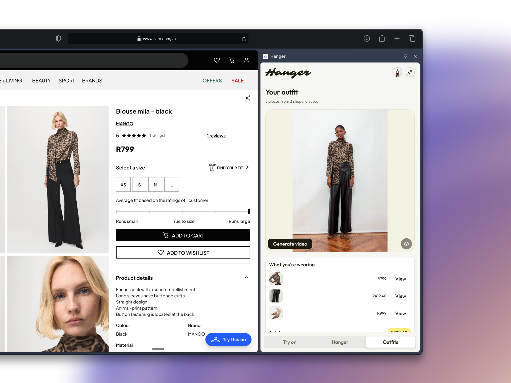
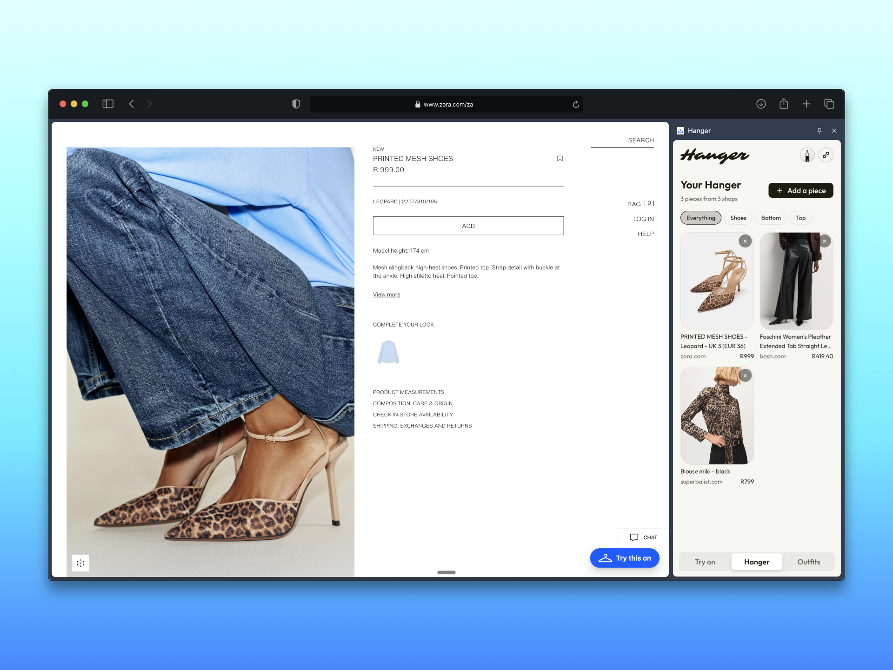
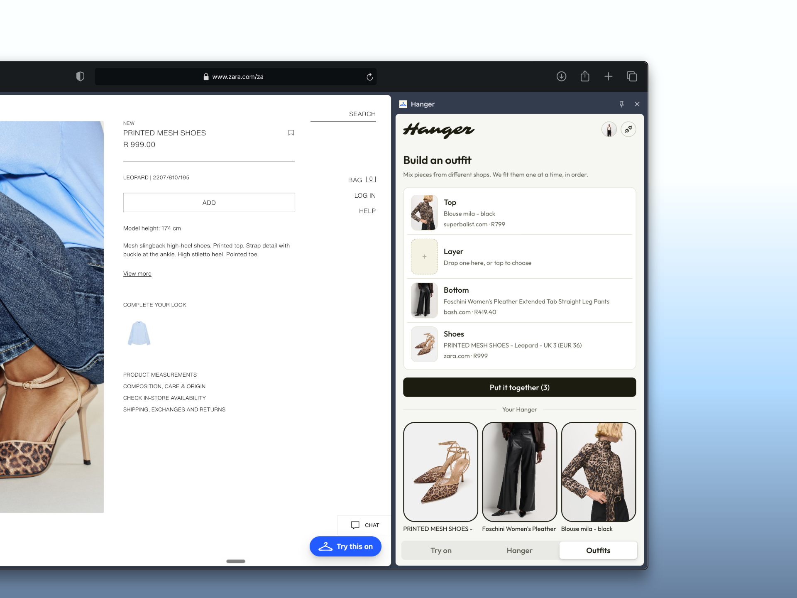
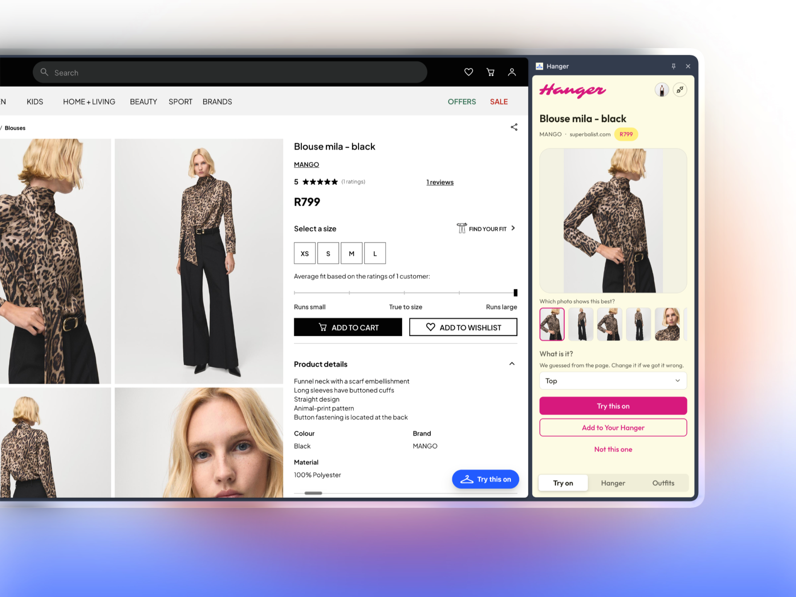
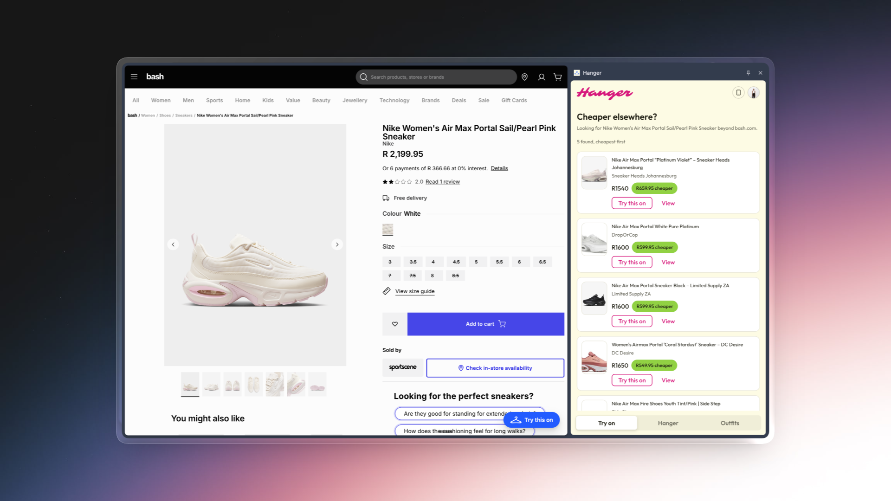
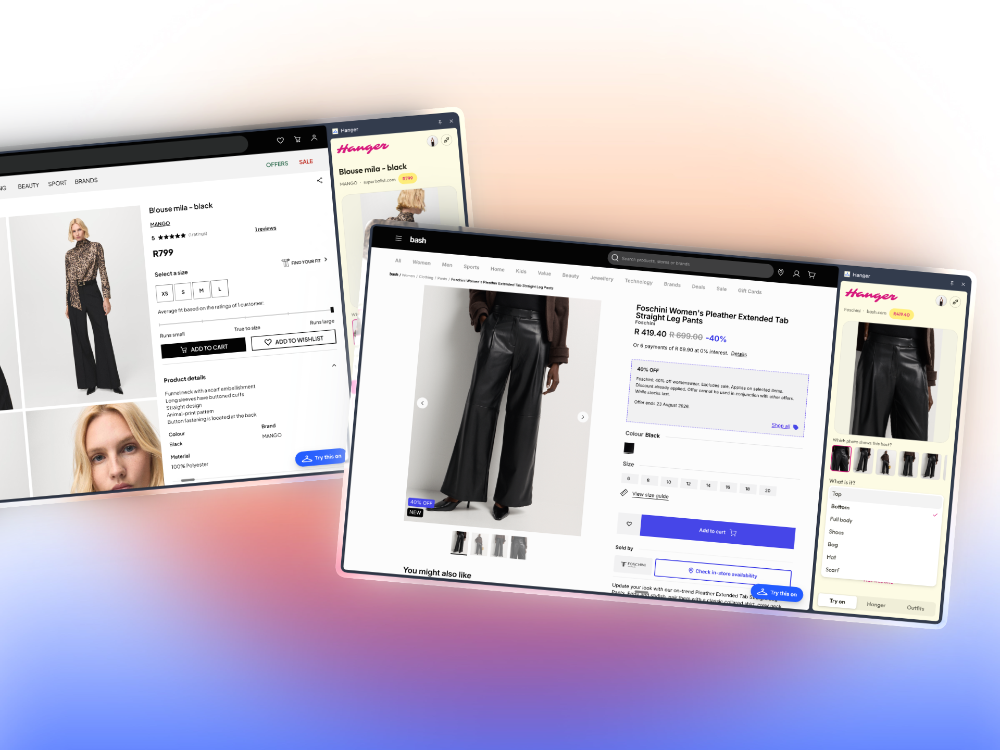
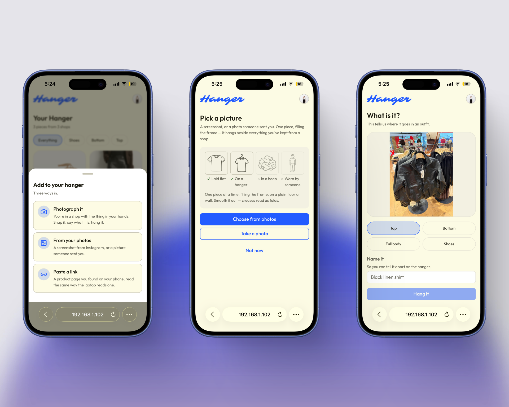
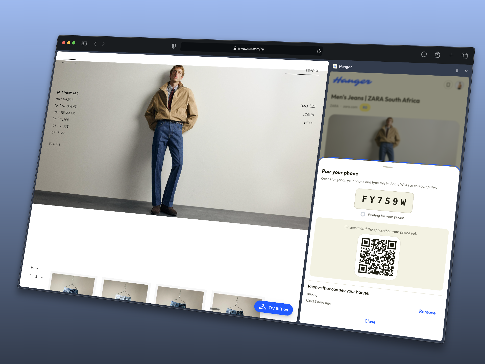

<div align="center">


# Hanger

**Your wardrobe, not their catalogue.**

Try on any garment from any shop, keep everything you find in one place, and
combine pieces from different shops into a single outfit image.

Built for the **YouCam API Skin AI & Apparel VTO Hackathon**, Apparel Virtual
Try-On track.



*A top from one shop, trousers from another, shoes from a third. One image, one total.*

</div>

---

## Contents

- [The problem](#the-problem)
- [What Hanger is](#what-hanger-is)
- [What it looks like](#what-it-looks-like)
- [**For judges: testing it**](#for-judges-testing-it) (start here)
- [How it works](#how-it-works)
- [Two apps, one wardrobe](#two-apps-one-wardrobe)
- [Design](#design)
- [What has run live](#what-has-run-live)
- [Known gaps](#known-gaps)
- [Repo layout](#repo-layout)
- [Development](#development)
- [How this maps to the judging criteria](#how-this-maps-to-the-judging-criteria)

---

## The problem

Online clothing returns run between 25% and 40%, and the reason is almost always
the same one. The customer couldn't tell how it would actually look on them. So
they buy two sizes, or two colours, and send one back. The shop pays for the
logistics, the customer waits, and the planet pays for the freight.

Virtual try-on exists to fix this, and it does fix half of it. The trouble is
that the half it fixes was never the hard part. **Every try-on that exists today
lives inside one shop's own website**, which means it can only ever show you
*their* clothes.

That limit isn't a technical one. It's a commercial one. No retailer has any
reason to show you how their jacket looks over somebody else's trousers, so
nobody has built it. But that is exactly the question a person is actually
asking when they shop:

> *Does this go with what I already have, and is there a cheaper one?*

**Hanger answers that question.** It sits above every shop rather than inside any
one of them.

---

## What Hanger is

A Chrome extension, a phone app, and one small server that both of them share.
Four things it does:

**1. Try on.** One saved photo, then any garment on any shop, without leaving the
page. No account with the retailer, no uploading your photo again on every site.

**2. Your Hanger.** Keep a garment from anywhere in one place. A Mango blouse
from Superbalist and a pair of Zara heels sit next to each other, each with its
own price and its own shop.

**3. Outfits.** A top from one shop, trousers from another, shoes from a third,
all composed into **one image**, with a shopping list and a total.

**4. Alternatives.** Search for the same garment elsewhere by its picture,
cheapest first, and try those on too. A R2,199.95 sneaker turning up for R1,540
somewhere else is a real result, not a mocked one.

The verb is **"Hang it"**, never "save" or "add to wishlist". The collection is
**"Your Hanger"**. That vocabulary is deliberate and it stays consistent
everywhere in the product.

### What makes it different, in one sentence

Point three is the one that doesn't exist anywhere else. **A single image of you
wearing clothes that are for sale in three different shops** is something no
retailer can build and no retailer wants to.

---

## What it looks like

### One wardrobe, three shops



Every piece keeps the shop it came from, its own price and a link back. Nothing
here is one retailer's catalogue.

### Building the outfit



Slots rather than a canvas, because clothes go on in an order and the try-on
fits them one at a time. The three filled slots name three different shops. The
empty Layer slot is there for a jacket over the top.

### Trying something on, in place



The panel reads the page for you. It picks the photo most likely to show the
garment on a person, guesses the category, and says so plainly enough that you
can correct it.

### The same thing, cheaper somewhere else



A R2,199.95 sneaker on one shop, found for R1,540 on another. The search runs on
the picture rather than the name, which is why it finds the same shoe at Sneaker
Heads Johannesburg and DropOrCop rather than five unrelated white trainers. Each
one can be tried on before you decide.

### The same thing, on somebody else's site



There is no special code for individual shops. The same reader runs on all of
them.

### On your phone



The phone does the thing a browser can't: you are standing in the shop with the
garment in your hands. Photograph it, say what it is, hang it. The third screen
is a real jacket on a real rail.

### Letting a phone in



Six characters, typed once. The QR is for a phone that doesn't have the app yet.

---

## For judges: testing it

There are two ways to test it. **The first needs no credentials at all** and
shows the entire product. The second spends real API credits.

### Path A: the full walkthrough, no credentials, about five minutes

```bash
git clone <this repo> && cd hanger
npm install
npm run dev
```

That is the whole setup. Sample mode is on by default, so a fresh copy runs from
start to finish on sample data and spends nothing. You need **Node 20 or newer**
and **Chrome 114 or newer**.

`npm run dev` starts the server on `http://localhost:8787` and builds the
extension into `extension/dist/`, then watches it for changes.

**Load the extension:**

1. Open `chrome://extensions`
2. Turn on **Developer mode**, top right
3. Click **Load unpacked**
4. Choose the **`extension/dist`** folder, not `extension/`
5. Pin Hanger to the toolbar

On a fresh copy there is **no sign-in and no setup**. The panel and the server
are running on the same machine, and that is proof enough of who you are. You go
straight to the product.

**Then walk through it:**

| # | Do this | You should see |
|---|---|---|
| 1 | Open the extension and add a photo of a person. Drag in any full-length photo, or use `server/fixtures/person-sample.svg` | It accepts the photo and never asks again |
| 2 | Go to any shop's product page. Uniqlo, Zara, H&M, Everlane, anything | A **Try this on** button appears bottom right, carrying the Hanger mark |
| 3 | Click it | The panel opens with the garment already read off the page: title, price, and a row of the page's photos with the best one already picked |
| 4 | Try it on | A result, then **Hang it** |
| 5 | **Go to a completely different shop.** Different website. Hang something from a different category, so trousers if the first was a top | Both garments now sit in Your Hanger, each showing its own shop and its own price |
| 6 | Open **Outfits** and build one. Put both garments in it | One image of the person wearing both, a shopping list with a line per garment, and a total |
| 7 | Swap **one** item for a third garment | It rebuilds, and the server log says `CACHE HIT`, because only the part that changed is recalculated |
| 8 | Open a garment and tap **Alternatives** | Similar items elsewhere, cheapest first, each with a working link to the shop |

**Steps 5 and 6 are the submission.** Everything else is table stakes. That pair
is the thing that cannot be done inside any shop's own website.

#### About the sample results

Sample results are **drawings, not photographs**. It's a simple figure that gains
one layer of clothing for each garment you add. This is deliberate, for two
reasons. It means sample mode genuinely demonstrates the thing the product is
for, because three garments really do produce a figure wearing three garments.
And it means nobody can mistake a sample for a real try-on. Every sample result
carries a caption saying *"Sample result, no API credits used"*.

The screenshots above are all live results, not samples.

### Path B: live, with a YouCam key

Copy `.env.example` to `server/.env` and fill in what you have:

| Setting | Needed for | Where to get it |
|---|---|---|
| `YOUCAM_API_KEY` | Real try-on | [yce.perfectcorp.com/api-console](https://yce.perfectcorp.com/api-console/en/), then Account, Redeem Code, API Keys |
| `SERPAPI_KEY` | Alternatives | [serpapi.com/manage-api-key](https://serpapi.com/manage-api-key) |
| `MOCK_MODE` | Set it to `false` to spend real credits | |
| `UNIT_BUDGET` | Spending cap for the whole server, 600 by default | |
| `USER_UNIT_CAP` | What one visitor may spend before their results become samples, 20 by default. `0` removes the limit | |
| `CLERK_SECRET_KEY` and `CLERK_PUBLISHABLE_KEY` | Accounts, which are optional. Without them everything runs as a single local person | Clerk dashboard, API keys |
| `SEARCH_COUNTRY` | Forces one country for the alternatives search. Left blank, each garment's own currency decides | |
| `MOCK_DELAY_MS` | How slow sample results pretend to be, 8000 by default | |

Restart the server after editing that file.

Without a `YOUCAM_API_KEY` the server **stays in sample mode even if you set
`MOCK_MODE=false`**, rather than failing every request with a login error.

The same eight steps apply. A live three-garment outfit is three API calls one
after another, so expect it to take a minute or two.

### If you only have 60 seconds

Run Path A and look at one screen: **an outfit built from two different shops**.
One image, two shops, two prices, one total. That is the whole argument.

### Checking the claims

Four checks, one command each.

**The API key never reaches the browser.** An unpacked extension is a zip file
anyone can open and read, so every call to YouCam and SerpApi goes through our
own server instead:

```bash
grep -ri "youcam_api_key\|Bearer " extension/dist/ | grep -v ".map"
```

Expect nothing back.

**Every failure shows a human sentence and something to do next.** In sample
mode you can force any of them:

```bash
curl -s localhost:8787/dev/errors | python3 -m json.tool
```

```bash
curl -s -X POST localhost:8787/dev/force-error -H 'Content-Type: application/json' -d '{"code":"error_pose"}'
```

The next try-on then fails that way. Send `{"code":null}` to switch it off.

**Spending is capped and reported.**

```bash
curl -s localhost:8787/health | python3 -m json.tool
```

That reports credits spent against the budget. At 80% of the budget the server
warns loudly. At 100% it refuses new live calls rather than quietly draining the
account.

**The page reader is tested against real shop pages, not made-up ones.**

```bash
npm run test:scrape --workspace extension
```

Nine pages saved from real shops. See
[Shops the page reader is tested against](#shops-the-page-reader-is-tested-against).

### The phone app

```bash
npm run dev:phone
```

That starts the server plus the phone app on `http://localhost:5174`. A judge can
look at it in a phone-shaped browser window without connecting a real phone. See
[On your phone](#on-your-phone).

---

## How it works

```
Chrome                                  localhost:8787
┌───────────────────────────┐           ┌────────────────────────────────┐
│ in the shop's page        │           │ Hono + SQLite + local storage  │
│  · spots a product page   │           │                                │
│  · reads it, ranks photos │           │  /person   /garments  /tryon   │
│  · fetches the image ─────┼──bytes───▶│  /outfits  /alternatives       │
│    from inside the page   │           │                                │
├───────────────────────────┤           │   youcam/client.ts ────────────┼──▶ YouCam
│ background worker         │           │   alternatives.ts  ────────────┼──▶ SerpApi
│  · opens the side panel   │           │   cache.ts · budget.ts         │
├───────────────────────────┤           │                                │
│ side panel (React)        │◀──JSON────│  every result saved to our own │
│  · butter theme (Astryx)  │  /media/  │  storage and served by us      │
└───────────────────────────┘           └────────────────────────────────┘
         ▲
         │  same server, same wardrobe
         ▼
┌───────────────────────────┐
│ phone app                 │
│  · camera, sharing        │
└───────────────────────────┘
```

**Built with:** TypeScript throughout. Hono and SQLite on the server, React 19
and Vite in both apps, Tailwind, the Astryx *butter* design system, and Clerk for
optional accounts.

Four decisions shape most of the code. Each one came out of reading the API
documentation before writing anything, rather than out of fixing something later.

### 1. The API key never reaches the browser

The YouCam API is designed to be called from a server, not from a web page. And a
Chrome extension is a zip file anyone can unpack and read. So every call to
YouCam and SerpApi goes through our own server. The extension never sees a key.

### 2. Shop image links are never handed to the try-on API

The API can fetch an image for you if you give it a link, but only if that link
is publicly downloadable by Perfect Corp's servers. Plenty of shops check who is
asking and refuse anyone who isn't a real visitor, which comes back as a download
failure.

So instead, the code that runs inside the shop's page fetches the image there,
where the browser looks like an ordinary visitor because it is one. It sends
those raw bytes to our server, and our server uploads them properly.

This is the only approach that works across shops in general, and it is the most
important detail in the whole build.

### 3. Outfits are built one garment at a time, and the work is remembered

The try-on API fits one garment per call. So an outfit is built in steps: the
result of the first garment becomes the starting photo for the second, and so on,
always beginning from your original photo.

Each step is remembered against **everything that came before it**, not just
against the garment. So swapping only the shoes in a three-piece outfit costs
**one** call instead of three, because the top-and-trousers stage has already
been worked out. The server log says `CACHE HIT tryon <key> (saved ~1 unit)` when
this happens, which is how you can see it working.

### 4. Every result is saved immediately

Results sit on YouCam's servers for 30 days behind links that expire. Keeping the
link would leave you with a wardrobe full of dead images, so the image is
downloaded into our own storage the moment it's ready. The apps only ever see a
link we serve ourselves.

### One more, about choosing the photo

The API documentation is clear that for trousers and skirts it needs a photo of
the garment **being worn**, not a flat product shot on a white background. A
flat-lay of jeans either fails or produces something unusable.

So the code reads **all** the photos on a product page, ranks them by how likely
each is to show the garment on a person, and shows you the row of them with the
best one already picked: *"Which photo shows this best?"* There is no special
handling for individual shops. It reads the page's own product information first,
and falls back to reading the page itself, everywhere.

You can see that row of photos in the try-on screenshot above.

---

## Two apps, one wardrobe

The wardrobe lives on the server. Both apps ask that same server for the same
things, so anything you hang on the laptop is already on the phone.

### The extension

Where shopping actually happens. It notices product pages, reads them, puts the
button on them, and opens the panel where you try things on and build outfits.

### On your phone

There is a second app in `pwa/`. The same wardrobe, on a phone. It does three
things a browser extension can't:

1. **You're standing in a shop.** The garment is in your hands, not on a website.
   Photograph it and hang it.
2. **You're in another app.** A screenshot from Instagram, a photo a friend sent
   on WhatsApp. On Android, Hanger appears in the share menu: screenshot
   something, tap Share, tap Hanger, and it lands in the app. Share a shop link
   from anywhere and the server reads the page for you. Apple doesn't allow
   either of those for web apps, so on an iPhone the same two routes sit on the
   Add screen as "From your photos" and "Paste a link".
3. **You're showing someone.** The phone's own share menu sends the outfit video
   to WhatsApp, Instagram or Messages in two taps. On a laptop that's a download
   and a drag.

```bash
npm run dev:phone
```

That serves the app on `http://localhost:5174`. Two ways to look at it:

- **On the laptop.** Open `http://localhost:5174` and make the window
  phone-shaped, or use the browser's device preview. Nothing to connect, because
  it's the same machine.
- **On your actual phone.** Same Wi-Fi as the laptop, then open
  `http://<your laptop's address>:5174`. The server prints the address it can be
  reached on when it starts up. Safari or Chrome will offer to add it to your
  home screen, where it opens without any browser around it.

The app works out where the server is by itself. If that guess is ever wrong,
**You**, then **Where the server is**, takes an address and remembers it.

#### Connecting a phone

A phone has to be let in once. On the laptop, tap the **phone icon** in the side
panel's header and it shows six characters. Type those into the phone and it
stays connected until you remove it. The same screen lists every phone that can
see your wardrobe, with a Remove next to each, and a QR code for a phone that
doesn't have the app yet.

Why this exists at all: the side panel runs on the same machine as the server, so
it can already prove who it is just by being there. A phone is a different
machine, and being on your Wi-Fi is not the same thing as owning the wardrobe.
The full reasoning is written at the top of
[server/src/auth.ts](server/src/auth.ts).

Two things to know. The phone has to be on the **same Wi-Fi** as the laptop with
the server running, which is the only real failure this app has, and the error
screen says exactly that. And the camera needs a secure connection, which a plain
local network address isn't.

---

## Design

The interface uses the **Astryx butter** design system, a warm and quiet palette
that stays out of the way of the clothes. The clothes are the only images on
screen that should be competing for attention.

| Used for | Light | Dark |
|---|---|---|
| Page | `#FDFBE4` | `#261A13` |
| Cards | `#FFFFFF` | `#2E2117` |
| Text | `#1d1c11` | `#f3f2e2` |
| Quieter text | `#605f52` | `#adac9e` |

The accent colour is **something you can change**, not a fixed value. It comes in
four strengths: full for the thing you press, softer for the thing you haven't
picked yet, and two washes behind them. Three choices ship:

| | Light | Dark | Notes |
|---|---|---|---|
| **Blue**, the default | `#225BFF` | `#FDEE8C` | Butter's own |
| **Pink** | `#D6187C` | `#FFB3DE` | Deep enough to carry white text on top |
| **Mono** | `#1d1c11` | `#f3f2e2` | Takes the backgrounds neutral too, because ink on a yellow page isn't what anybody means by black and white |

It lives on the profile screen rather than in the header. A control in the header
reads as something you *use*, and this is something you *set once*. It only
appears once you've added a photo, so it never competes with the single real
decision in onboarding. The screenshots above show two of the three: the wardrobe
and the phone in blue, the try-on panel in pink.

### The mark

One drawing, [`shared/assets/logo/hanger-mark.svg`](shared/assets/logo/hanger-mark.svg),
is the source for every icon in the product: the extension's icons, the phone
app's home screen icon, and the button that appears on shop pages. Redrawing it
updates all of them, rather than leaving one stale copy somewhere.

That button on a shop page is the only place Hanger appears on somebody else's
surface, so it wears the real mark rather than an impression of it. It costs
1.4 kB, and it's worth it. You can see it sitting at the bottom right of every
shop page in the screenshots above.

### The writing

Plain and short. No exclamation marks, no "Oops!", no emoji in the interface.
Every failure gets a human sentence *and* something to do next. Never a code,
never a spinner that ends in nothing.

---

## Shops the page reader is tested against

There is no special code per shop. The same reader runs everywhere, taking the
page's own product information first and falling back to reading the page itself.
It's checked against pages saved from real shops:

```bash
npm run test:scrape --workspace extension
```

| Shop | Built with | What the saved page tests |
|---|---|---|
| Uniqlo (t-shirt and trousers) | Custom | Only social sharing tags to work from, plus lower-body category |
| Nike | Custom | Structured product data as the only usable signal |
| Gap | Next.js | An empty shell, with nothing readable outside a browser |
| Everlane | Shopify | Structured data, sharing tags and a buy button |
| Passenger | Shopify | Complete product information |
| Percival (t-shirt and trousers) | Shopify | Needs a worn photo for the trousers |
| Allbirds | Shopify | Working out that something is a shoe |

The server reads the same nine pages, without a browser, for the phone's "paste a
link" option:

```bash
npm run test:links --workspace server
```

Eight of the nine can be hung from the page alone, with the right title, the
right category and the right price wherever the page carries one. The ninth is
Gap, whose page is an empty shell. The extension can't read that either, and both
routes send you to the camera instead. To point it at a live page:

```bash
npx tsx scripts/read-link.ts https://someshop.com/product/thing
```

Two limits worth stating plainly:

- The test runs without a real browser, so it can't measure how big the images
  actually are or sample their colours. Those are two of the signals used to pick
  the best photo. Everything else is fully tested, but the size-based parts only
  work in a real browser.
- Gap and Uniqlo build their product pages in the browser, so their saved pages
  carry very little. Their tests only check what the page really contains, and
  say so in the output.

---

## What has run live

Written down because it was wrong here for a while, and an out-of-date list of
missing pieces is worse than none. It talks people out of things that already
work.

With a real `YOUCAM_API_KEY` and sample mode off, the core of this has been run
against the live APIs, not just against sample data:

- **Try-on, and building an outfit from several garments.** Real API calls, with
  results saved to our own storage as the real images they are. Sample results
  are drawings, so a photograph in the results is by definition something YouCam
  made.
- **Across shops, which is the whole claim.** Garments saved from bash.com,
  superbalist.com and zara.com, composed into three-piece outfits of a top,
  trousers and shoes in one image.
- **Video.** Real calls, finished videos served from our own storage.
- **Alternatives.** Real search results: real shops, real product links, real
  prices.
- **Two accounts on one server**, each with their own photo and their own
  wardrobe.
- **Reading a shop link on the server**, against live pages from Uniqlo,
  Allbirds, Gap, Superbalist and H&M, on top of the nine saved ones. Two of those
  five taught us something. Allbirds hands back its own logo instead of the
  product on an out-of-date link, and H&M refuses a request from a server
  outright. Both are handled, the second by saying so and offering the camera.

`GET /health` reports what has been spent. Those numbers are the record. Nothing
in this section is guessed from reading the code.

---

## Known gaps

Stated plainly, because a submission that hides them is worse than one that
doesn't.

- **Photo Enhance isn't wired up for live mode.** Rescuing a too-small
  alternative thumbnail needs the exact API path confirmed first, so rather than
  guess at it, the code returns nothing and the app says "open the product page
  to try this on". Sample mode does exercise the path.
- **Alternative prices can carry the wrong currency.** A result from a foreign
  shop whose price doesn't say what currency it's in gets stamped with the local
  one. An adidas Oman listing came back as 18 rand. Sorting cheapest first is the
  entire point of that screen, so a wrong price doesn't just read badly, it sorts
  straight to the top.
- **The search results reader was built from the search provider's published
  example** rather than a live response. It has since been given live responses
  without a mismatch, and the first response of every run logs its shape, so a
  future change announces itself rather than quietly returning an empty list.
- **A shared screenshot isn't identified, it's asked about.** The plan was to run
  it through the image search. That search takes a link and fetches the picture
  itself, and a photo out of somebody's camera roll has no public link to give
  it. So a shared picture lands on the same "what is it?" screen a photographed
  one does. Links, which carry their own details, fill themselves in.
- **Some shops can't be read from a link at all.** Pages built entirely in the
  browser (Gap) carry nothing useful, and shops with bot protection (H&M) refuse
  the request. Both end in a sentence and the camera, never a spinner.
- **It runs on a laptop.** The hosting configuration is written but nothing is
  deployed, so the phone still needs the laptop switched on and on the same
  Wi-Fi.
- **React 19 and Tailwind 4**, where the plan said older versions of both. The
  butter design system requires the newer ones, and the design system was the
  fixed requirement, so the versions gave way.
- **Hats, scarves and the editorial bag shot aren't built.** The bag API turned
  out not to fit the way outfits are built here. It takes a head-and-shoulders
  selfie and regenerates a whole styled scene, rather than adding a bag to an
  existing image, so it was never going to be another layer in an outfit. That's
  written up in [AGENTS.md](AGENTS.md) rather than discovered late.

---

## Repo layout

```
server/
  src/
    index.ts          the app, and who is allowed to talk to it
    auth.ts           one place that answers: whose wardrobe is this?
    users.ts          the people; every garment belongs to one
    media.ts          signed, expiring image links
    pairing.ts        the six-character codes, and connected phones
    env.ts db.ts      settings, checked on start; database upgrades
    storage.ts        the images we keep, served at /media/:name
    images.ts         checking a photo is usable before spending anything
    cache.ts          remembering work already done
    budget.ts         the spending limit
    mock.ts           sample mode, and mock/figure.ts draws the samples
    alternatives.ts   the image search, and filtering what comes back
    youcam/
      client.ts       uploading, starting a job, waiting, downloading
      engine.ts       the one switch between sample and real
      tryon.ts        a single garment
      chain.ts        several garments, one image
      errors.ts       turning a failure into a sentence
    routes/           person, garments, tryon, outfits, alternatives,
                      pairing, handoff, links, dev
  fixtures/           sample data; a fresh copy runs on these
extension/
  src/
    content/          noticing product pages, reading them, ranking photos,
                      fetching the image from inside the page
    background/       opens the side panel
    sidepanel/        the app itself: Onboarding, TryOn, Hanger, OutfitBuilder,
                      Outfits, Alternatives, AddOwned
  scripts/pages/      product pages saved from real shops, for the tests
shared/               one copy of anything more than one app needs
  src/
    types.ts          the shapes the server and both apps agree on
    api.ts            how the apps talk to the server
    format.ts         prices
    theme/            the butter theme, the three accents, the icons
    illustrations/    the drawings that show how to photograph a garment
    logo/mark.ts      the mark as data, for the shop-page button
  assets/logo/        the hanger mark, the one drawing every icon comes from
pwa/                  the phone app, see PWA.md
  src/
    App.tsx           header, one scrolling area, tabs at the bottom
    server.ts         works out which machine the server is on
    device.ts         this phone's connection
    screens/          Hanger, Outfits, OutfitDetail, Me, AddSheet, AddGarment,
                      AddLink, BuildOutfit, TryOn, Pair
    components/       GarmentCard, Sheet, TabBar, FilterChip, ErrorNote,
                      PhotoPick, CategoryPick, ShareCard
```

### The documents

| File | What it is |
|---|---|
| **README.md** | This file. What it is, and how to run and test it |
| [AGENTS.md](AGENTS.md) | The full build specification: constraints, API details, data model, build order, and what counts as done |
| [PWA.md](PWA.md) | The phone app's specification and build order |
| [SUBMISSION.md](SUBMISSION.md) | The hackathon answers and the demo video plan |
| [docs/ASSETS.md](docs/ASSETS.md) | Which screenshots go where |

---

## Development

```bash
npm run dev                                # server and extension, watching
npm run dev:phone                          # server and phone app on :5174
npm run typecheck                          # everything
npm run test:scrape --workspace extension  # the page reader, against saved pages
npm run test:links --workspace server      # reading a shop link on the server
npm run build --workspace extension        # production extension
npm run build:pwa                          # production phone app
```

After a rebuild, reload the extension with the circular arrow on its card in
`chrome://extensions`. Chrome assigns the extension its ID when you load it. If
you turn accounts on, add `chrome-extension://<that id>` to the allowed addresses
in your Clerk settings, and keep that ID stable once the extension is shared.

To look at the side panel as an ordinary web page, which is handy for design
work:

```bash
npx serve -l 5599 extension/dist
```

then open `http://localhost:5599/sidepanel.html`.

### Not spending credits by accident

Built in from the first commit, rather than added later:

- Sample mode is on by default, so all the interface work costs nothing.
- Work that's already been done is remembered, and the log says so.
- `GET /health` reports what's been spent against the budget.
- At 80% of the budget the server warns loudly. At 100% it refuses new live calls
  rather than quietly draining the account.
- There's a per-visitor limit for a public demo. Past it everything keeps
  working, the results are just samples, and they say so.

### Hosting

[`render.yaml`](render.yaml) is written. One service, serving both the API and
the phone app from the same address, so the phone talks to the same place it came
from and a judge only needs one link. It runs a proper container rather than a
serverless function, because a try-on can take up to five minutes and serverless
hosts cut requests off long before that. And it keeps a real disk, because the
cheap option wipes its storage on every deploy, which would take somebody's whole
wardrobe with it.

Nothing is deployed yet. See [Known gaps](#known-gaps).

---

## How this maps to the judging criteria

| Criterion | Where to look |
|---|---|
| **Technological Implementation** | Building one image out of several garments, and remembering the work so an edit costs one call instead of three. Fetching product images from inside the shop's own page, which is the only way this works across shops in general. Searching for the same garment elsewhere by its picture. A spending limit that actually stops. One place in the code that decides whose wardrobe a request is for. This is not one API call behind a button. |
| **Design** | A complete product rather than a demo: onboarding, the wardrobe, the outfit screen, alternatives, real empty and loading and failure states, a second app on the phone, a colour you can change, and one drawing behind every icon. Every failure has a human sentence and something to do next, and you can force each one yourself. |
| **Potential Impact** | Fewer returns, and an answer to a question no single shop will ever answer: *does this go with what I already have, and is there a cheaper one?* |
| **Quality of the Idea** | Combining clothes across shops, and finding the same thing cheaper elsewhere. The try-on is what makes it possible. The cross-shop wardrobe is the product. |

---

## Credits and licence

Built by [Tlotliso Morethi](https://github.com/tlotliso) for the YouCam API Skin
AI & Apparel VTO Hackathon, 2026.

- Try-on and video: **YouCam by Perfect Corp**, AI Clothes Virtual Try-On and
  image-to-video
- Searching by picture: **SerpApi**
- Design system: **Astryx butter**
- Accounts: **Clerk**

Shop names and product pages appear only incidentally, as the places a person
would actually be browsing. No affiliation is claimed or implied.

<!-- Add a LICENSE file and name it here. MIT is the usual choice for a
     hackathon entry. -->
